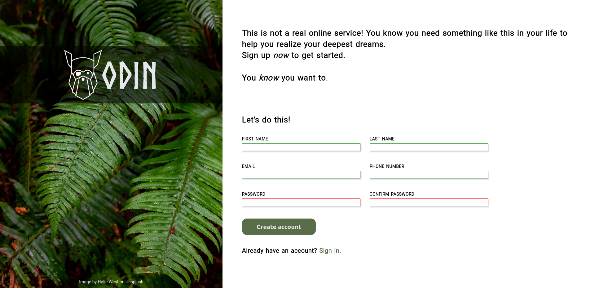

    
    <h1>Web Form </h1>
    
Simple webpage form

    

        <a href="https://jotafer19.github.io/sign-up-form/" target="_blank" rel="noreferrer noopener">View Demo</a> · 
        <a href="https://github.com/jotafer19/sign-up-form/issues" target="_blank" rel="noreferrer noopener">Report Bug</a> ·
        <a href="https://github.com/jotafer19/sign-up-form/issues" target="_blank" rel="noreferrer noopener"> Request Feature</a>
    

## Preview

### Features

- A simple webpage built to test forms.
- It can compare passwords fields to check if they match each other.
- Clean UI for better visuals, with indicators for valid inputs.

### Built With

-    
-    
- 

### Tools Used

- 
-   
- 

## Usage

- Enter the information required by the page.
- If the information is wrong, it will display an error message and the border will turn red.
- Submit button will not work if both passwords are not the same.

## Outcome

* Used HTML **forms** to take information from the user.
* Used CSS **grid** and **flex** to manage layout.
* Used **JavaScript** for checking passwords.
* Used **Git** and **GitHub** for project management.
* Tried to maintain **clean code**.

## What I learned

* Better knowledge and it's practical usability of **HTML forms**.
* A lot of minor things.

## Acknowledgments

* Inspiration by [**The Odin Project**](https://www.theodinproject.com/lessons/node-path-intermediate-html-and-css-sign-up-form).